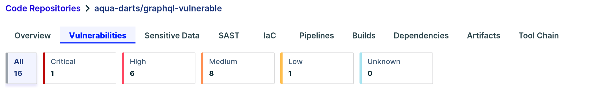
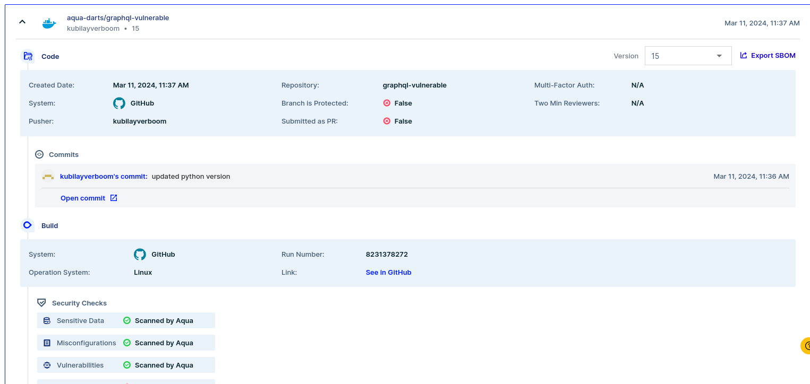
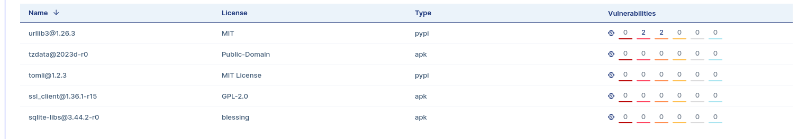
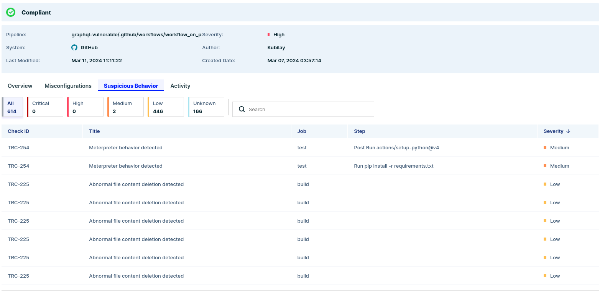
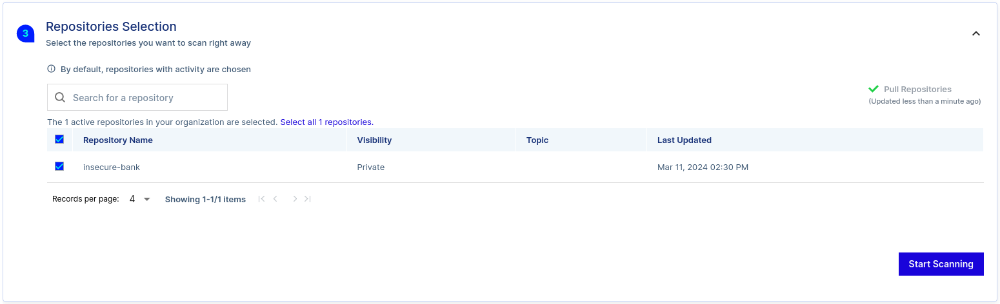

# AquaSecurity - Supply Chain (DART-1)
> Date: 2024-03-07
> Tags: #AquaSecurity #DART-1 #Supply_Chain

## I. SCM Integration
The first step is to add the  Hydrogic GitHub SCM in the Aqua Hub. This can be done in the `Supply Chain Security` module. Under `Integrations -> Supply Chain`. Integrating steps with an existing SCM is straight forward. Once the SCM in connected the Aqua platform will scan the repository. The results of the scan show security issues in the repository.


Specifically the following vulnerabilities severity are found in the repo:

### Assurance Policies
Assurance policies are used to secure assets and to identify issues which need to addressed. There  are different types of policies and controls to monitor different type of assets. Three new Assurance Policies for code scanning will be created. The policies will fail **Builds** and **PRs** if the repository is non-compliant.

| Name     | Action(s)                                | Controls                                                                                     |
| -------- | ---------------------------------------- | -------------------------------------------------------------------------------------------- |
| Policy 1 | Audit Message<br>Fail PRs<br>Fail Builds | Vulnerability Severity control and filter for Critical severity. Don't enable any exceptions |
| Policy 2 | Audit Message<br>Fail PRs<br>Fail Builds | Sensitive Data control and filter for Critical severity                                      |
| Policy 3 | Audit Message<br>Fail PRs<br>Fail Builds | IaC Misconfiguration control and filter for Critical severity                                |

## II. CI Integration
To enforce the assurance policies on the repository an extra step needs to be added in the pipeline. For this an API key/secret is needed which needs to be generated in the Aqua Security portal.

After the API key and secret are generated. In the **Integrations** sections in the **Supply Chain Security** module the integration can be setup. For the DARTS training integration with GitHub actions will be made. So the `workflow.yaml` needs to be edited so it has an extra step, which is scanning on **push** and and **pr**. So the workflow now looks like the following:

```yaml
name: Test, build, and Scan

on: [push, pull_request]

jobs:
  test:
    runs-on: ubuntu-20.04
    steps:
      - uses: actions/checkout@v3
      - uses: actions/setup-python@v4
        with:
          python-version: '3.6'
          cache: 'pip'
      - run: pip install -r requirements.txt

      - name: Run DVGA
        run: |
          nohup python3 ./app.py &

      - name: Wait for server (sleep 5 secs)
        run: |
          sleep 5

      - name: Run DVGA Tests
        run: |
          python3 -m pytest tests/*
  
  build:
    runs-on: ubuntu-22.04
    needs: test
    steps:
      - uses: actions/checkout@v3

  aqua:
    runs-on: ubuntu-latest
    needs: build 
    steps:
      - name: Checkout code
        uses: actions/checkout@v2

      - name: Run Aqua scanner
        uses: docker://aquasec/aqua-scanner
        with:
          args: trivy fs --scanners config,vuln,secret .
        env:
          AQUA_KEY: ${{ secrets.AQUA_KEY }}
          AQUA_SECRET: ${{ secrets.AQUA_SECRET }}
          GITHUB_TOKEN: ${{ github.token }}
          AQUA_URL: https://api.eu-1.supply-chain.cloud.aquasec.com
          CSPM_URL: https://eu-1.api.cloudsploit.com
          TRIVY_RUN_AS_PLUGIN: 'aqua'

```

Now on a new **push** and **pr** it triggers an extra step which scans the repository. On the first scan in the pipeline, the following results are shown:
```bash
Policy 'Policy 1' - FAILED
╭────────────────────────┬────────────────┬───────────┬────────────────────╮
│     FAILED CONTROL     │  MATCHED DATA  │ INSTANCES │      LOCATION      │
├────────────────────────┼────────────────┼───────────┼────────────────────┤
│ Vulnerability Severity │ CVE-2023-41419 │ 1         │ ./requirements.txt │
│ CRITICAL AND ABOVE     │                │           │                    │
╰────────────────────────┴────────────────┴───────────┴────────────────────╯
Policy 'Policy 2' - FAILED
╭─────────────────────────┬───────────────────┬───────────┬──────────────────╮
│     FAILED CONTROL      │   MATCHED DATA    │ INSTANCES │     LOCATION     │
├─────────────────────────┼───────────────────┼───────────┼──────────────────┤
│ Sensitive Data Severity │ aws-access-key-id │ 1         │ ./iac-secrets.tf │
│ CRITICAL AND ABOVE      │                   │           │                  │
╰─────────────────────────┴───────────────────┴───────────┴──────────────────╯
Policy 'Policy 3' - PASSED
Policy Summary
[TOTAL: 3 | PASSED: 1 | WARNED: 0 | FAILED: 2]
2024-03-07 14:24:51 ERR failed to execute command - 2 enforced policy control failure(s).
```

Which is very interesting that Policy 3 has the status PASSED. After checking the policy and it's scopes nothing seems out of the ordinary. Looking in the provided code repository it a very interesting unscanned file catches the eye: `insecure-db.tf` on further inspection, this file setups a RDS DB in AWS. So adding the extra control in Policy 3 helps by finding vulnerabilities in this IaC code. The extra control is **iaC Misconfiguration by Service**.

When the pipeline runs now Policy 3 also fails.
```bash
 Policy 'Policy 3' - FAILED
╭─────────────────────────────────┬──────────────┬───────────┬──────────────────╮
│         FAILED CONTROL          │ MATCHED DATA │ INSTANCES │     LOCATION     │
├─────────────────────────────────┼──────────────┼───────────┼──────────────────┤
│ IaC Misconfiguration by Service │ AVD-AWS-0077 │ 1         │ ./insecure-db.tf │
│ Provider:AWS                    │              │           │                  │
│ Service:rds                     │              │           │                  │
├─────────────────────────────────┼──────────────┼───────────┼──────────────────┤
│ IaC Misconfiguration by Service │ AVD-AWS-0080 │ 1         │ ./insecure-db.tf │
│ Provider:AWS                    │              │           │                  │
│ Service:rds                     │              │           │                  │
├─────────────────────────────────┼──────────────┼───────────┼──────────────────┤
│ IaC Misconfiguration by Service │ AVD-AWS-0133 │ 1         │ ./insecure-db.tf │
│ Provider:AWS                    │              │           │                  │
│ Service:rds                     │              │           │                  │
├─────────────────────────────────┼──────────────┼───────────┼──────────────────┤
│ IaC Misconfiguration by Service │ AVD-AWS-0176 │ 1         │ ./insecure-db.tf │
│ Provider:AWS                    │              │           │                  │
│ Service:rds                     │              │           │                  │
├─────────────────────────────────┼──────────────┼───────────┼──────────────────┤
│ IaC Misconfiguration by Service │ AVD-AWS-0177 │ 1         │ ./insecure-db.tf │
│ Provider:AWS                    │              │           │                  │
│ Service:rds                     │              │           │                  │
├─────────────────────────────────┼──────────────┼───────────┼──────────────────┤
│ IaC Misconfiguration by Service │ AVD-AWS-0180 │ 1         │ ./insecure-db.tf │
│ Provider:AWS                    │              │           │                  │
│ Service:rds                     │              │           │                  │
╰─────────────────────────────────┴──────────────┴───────────┴──────────────────╯
```

So the pipeline fails, this is the expected behavior. Let's raise a pull request anyway! And the pull request fails, because of the security miscommunications. Let's fix these using the Aqua Vulnerability Database.

### Policy 1 - Requirement.txt CVE-2023-41419
This one is pretty straight forwards. There is an issue in Gevent versions before 23.9.0 which allows a remote attacker to escalate privileges via a crafted script to the WSGIServer component.  Updating the version from 21.12.0 to 23.9.0

### Policy 2 - iac-secrets.tf aws-access-key-id
This one is also pretty straightforward. The AWS Access key/secret are hard coded in the repository. There are multiple ways to fix this, but for convenient we are going to add the secret values in the pipeline using Environment Variables.

### Policy 3 - IaC misconfiguration by Service
This one requires more steps, but luckily the fixes can be found using the ID of the vulnerabilities presented in the result table. So first, going through the fixes one by one:

1. AVD-AWS-0077 - This means that there is no back-up retention set longer then the default of one day. To fix this `backup_retention_period = 5` can be added to set the retention to 5 days.
2. AVD-AWS-0080 - This means that there is no encryption enabled at a DB level. Simply adding the following flag will fix this `storage_encrypted = true.
3. AVD-AWS-0133 - This means that the performance Insights isn't enabled to detect potential issues with the RDS. `performance_insights_kms_key_Id = true` will fix this.
4. AVD-AWS-0176 - This means that Iam Auth isn't enabled for the database. `  iam_database_authentication_enabled = true` 
5. AVD-AWS-0177 - This means that the deletion protection isn't enabled on the RDS database. `deletion_protection = true`
6. AVD-AWS-0180 - This means that the database is publicly accessible. `publicly_accessible = false`

Fixing these issues results in the the pipeline passing all checks for the assurance policies!

```shell
Policy 'Policy 1' - PASSED

Policy 'Policy 2' - PASSED

Policy 'Policy 3' - PASSED

Policy Summary
[TOTAL: 3 | PASSED: 3 | WARNED: 0 | FAILED: 0]
```

## III. Software Bill Of Materials (SBOM)
A SBOM is a list of all components in a piece of software. Thee components can include open-source packages, libraries, modules, and even snippets of code. A SBOM providers clear insight into what's in your software and enables the identification of potential security vulnerabilities of components. Also an SBOM can help ensure that all software components are sued in compliance with the licences.

The SBOM can be enabled through **Release Artifact** and then the **Integrate** button which shows the steps that are needed to integrate the SBOM. This will generate the following steps in the GitHub pipeline:

```yaml
- name: Manifest Generation
        run: |
          export BILLY_SERVER=https://billy.eu-1.codesec.aquasec.com
          curl -sLo install.sh download.codesec.aquasec.com/billy/install.sh
          curl -sLo install.sh.checksum https://github.com/argonsecurity/releases/releases/latest/download/install.sh.checksum
          if ! cat install.sh.checksum | sha256sum --check; then
          echo "install.sh checksum failed"
          exit 1
          fi
          BINDIR="." sh install.sh
          rm install.sh install.sh.checksum
          ./billy generate \
            --access-token "${{ secrets.GITHUB_TOKEN }}" \
            --aqua-key "${{ secrets.AQUA_KEY }}" \
            --aqua-secret "${{ secrets.AQUA_SECRET }}" \
            --cspm-url https://eu-1.api.cloudsploit.com \
            --artifact-path "my-image-name:${{ env.tag-version }}" 

            # The docker image name:tag of the newly built image
            # --artifact-path "my-image-name:${{ env.tag-version }}" 
            # OR the path to the root folder of your project. I.e my-repo/my-app 
            # --artifact-path "${{env.MY_APP_ROOT}}"
```

Adding this step and looking in the artifacts tab, shows information about actions in commits and pull requests.


This also shows that some dependencies of the Docker image have vulnerabilities:


## IV. Build Pipeline Activity Monitoring
Pipeline Activity Monitoring  enables monitoring of the build process and ensures that no threats find their way into the artifacts at this stage of the SDLC. For this it is important that the GitHub Actions Token has the corrects permissions. 

Going to the **Build Pipelines** section shows all the pipelines that are available on the SCM. Clicking on any pipeline and then the Activity tab, will show the activities in that pipeline. It's not configured yet, this can be done by pressing the **Integrate** button. This will show a snippet to add in the GitHub workflow:
```yaml
- name: Setup pipeline enforcer
  uses: aquasecurity/pipeline-enforcer-action@main
  env:
    CSPM_URL: https://eu-1.api.cloudsploit.com
    AQUA_URL: https://api.eu-1.supply-chain.cloud.aquasec.com
  with:
    aqua-key: ${{ secrets.AQUA_KEY }}
    aqua-secret: ${{ secrets.AQUA_SECRET }}
```

With the pipeline monitor enabled, it is possible to see what the build stage does, for example in the current pipeline it shows that there are 614 suspicious activities going on. So for example:


## V. Integration with on-prem SCM
It is also possible to integrate an on-prem SCM's in Aqau Security. When deploying on GitLab, a personal access token is required with the following privilges:
- read-api
- read-repository
- read-user

Codependent on where the on-prem SCM is running either Docker or Kubernetes can be used. For this example K8S deployment will be used. The command for basic configuration looks like:

```bash
helm upgrade -i aqua-codesec aqua-helm/codesec-agent --namespace aqua-codesec \
--create-namespace \
--set global.connectServerUrl=https://connect.eu-1.codesec.aquasec.com \
--set global.scanServerUrl=https://scan.eu-1.codesec.aquasec.com \
--set global.aquaServerUrl=https://api.eu-1.supply-chain.cloud.aquasec.com \
--set global.cspmServerUrl=https://eu-1.api.cloudsploit.com \
--set integration.source=gitlab_server \
--set credentials.aqua_key= <Aqua_Key> \
--set credentials.aqua_secret= <Aqua_Secret> \
--set integration.url=http://gitlab-service.gitlab.svc.cluster.local:80 \
--set integration.username=Aqua \
--set integration.password=<GitLab_PAT>
```

After installing the scanner it is possible to scan the repositories on the local SCM.


## Summary


## Additional Resources
- [Links to relevant resources]