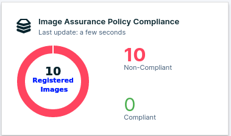
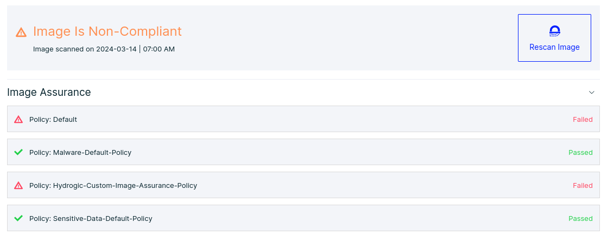

# AquaSecurity - Workload Protection (DART-2)
> Date: 2024-03-12
> Tags: #AquaSecurity #DART-2 #Workload_Protection

## I. Image Registry
The Workload Protection module scan images in a registry for vulnerabilities, it can also scan active images that are being used.

Integrating an image registry is easy, this can be done through **Administration** -> **Integrations**.


With the registry integrated, images in that registry can be scanned. This can be through **Images & Functions** -> **Images** -> **Add Images**. For the assignment, the `jerbi/eicar:latest` image will be scanned. The initial scan will show that the image has two critical CVEs and three forms of malware.


Next to being able to add and scan images manually, it is possible to automate this task. This can be done through **Administration** -> **Integrations** -> **${registry_name}** -> **Registry Configurations**.


### Additional Scanner
Next to being able to scan an image registry, it is also possible to deploy a scanner in a K8S cluster. This way, images used in production are being scanned. The deployment can be done through **Administration** -> **Scanners**.

The command that is needed to deploy the scanner is shown:
```bash
docker run -d  registry.aquasec.com/scanner:2402.8.22 daemon --token ${token} --host https://7b02ff4f90.cloud.aquasec.com
```

When the container is deployed successfully it can be listed:


After the scanner is deployed, under **Administration** -> **Integrations** the Hydrogic scanner can connected to the Hydrogic registry for image scanning.


## II. Assurance Policies
Assurance policies act as compliance gates for SDLC. They define which images and other artifact are considered safe enough to progress to production environments.

For this assignment three custom Assurance Policies are created. One which checks images, one check the Kubernetes cluster and the other one check if the host system is compliant. After the custom policies are created and for example the images are scanned, it can be noted in the dashboard that all 10 images in the Hydrogic repository are non-compliant.



For further analysis an image can be inspected to see which Assurance Policies it fails and potentials remediation to make the images compliant.



### Dynamic Threat Analysis (DTA)


## III. Main Topic 3
 

## Summary
- [Summarize the main points of the outline]

## Additional Resources
- [Links to relevant resources]